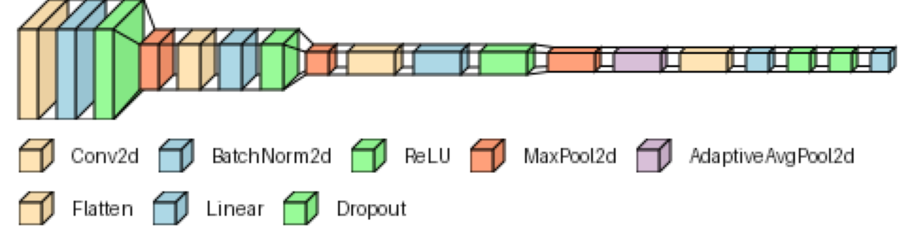

# Facial Emotion Recognition
---
## Version 1.0
This is also just a practice for learning pytorch. It is the second practice. The first one is [here](https://github.com/EMEEEEMMMM/ChineseDigitRecognition) So here is the network:


```
class CNN(nn.Module):
    def __init__(self):
        super().__init__()
        self.cnn = nn.Sequential(
            # Input 3x48x48
            nn.Conv2d(in_channels=3, out_channels=64, kernel_size=3, padding=1),
            nn.BatchNorm2d(64),
            nn.ReLU(inplace=True),
            nn.MaxPool2d(kernel_size=2),
            # Input 64x24x24
            nn.Conv2d(in_channels=64, out_channels=128, kernel_size=3, padding=1),
            nn.BatchNorm2d(128),
            nn.ReLU(inplace=True),
            nn.MaxPool2d(kernel_size=2),
            # Input 128x12x12
            nn.Conv2d(in_channels=128, out_channels=256, kernel_size=3, padding=1),
            nn.BatchNorm2d(256),
            nn.ReLU(inplace=True),
            nn.MaxPool2d(kernel_size=2),
            # Input 256x6x6
            nn.AdaptiveAvgPool2d((1, 1)),
            nn.Flatten(),
            nn.Linear(256, 128),
            nn.ReLU(inplace=True),
            nn.Dropout(0.5),
            nn.Linear(128, 8),
        )

    def forward(self, x):
        return self.cnn(x)
```
This model's accuracy after 50 epochs will reach around 60%
```
Epoch 50/50 ----------------------------------------
Batch 0/252 | Loss: 1.1548 | Samples/sec: 2865 | LR: 1.0e-04
Batch 50/252 | Loss: 1.1075 | Samples/sec: 146 | LR: 1.0e-04
Batch 100/252 | Loss: 1.1158 | Samples/sec: 146 | LR: 1.0e-04
Batch 150/252 | Loss: 1.1156 | Samples/sec: 147 | LR: 1.0e-04
Batch 200/252 | Loss: 1.1179 | Samples/sec: 146 | LR: 1.0e-04
Batch 250/252 | Loss: 1.1191 | Samples/sec: 149 | LR: 1.0e-04
Test Results | Accuracy: 59.7% | Avg loss: 1.0893
Done!
```

There are tensorboard logs in
```
logs
├── events.out.tfevents.1751519047.bear.1056600.0
└── events.out.tfevents.1751519544.bear.1064911.0
```
---
## Dataset
https://www.kaggle.com/datasets/mstjebashazida/affectnet

---


<p style="text-align:right; margin: 0; font-size: 10px">
    Grade 9    2025/07/03
</p>